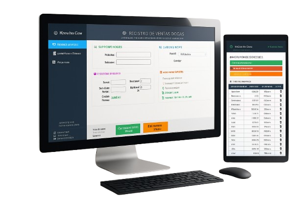
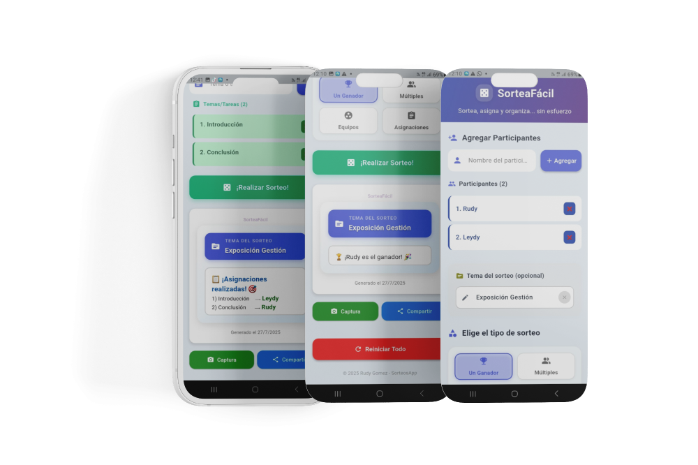
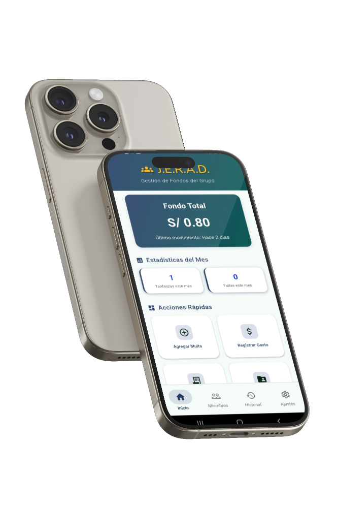

# 👋 ¡Hola! Soy Rudy Gomez Bellido

  

---

## 🚀 Sobre Mí

<table>
<tr>

Soy un **estudiante apasionado de Ingeniería de Sistemas** en la Universidad Nacional de San Cristóbal de Huamanga (UNSCH), enfocado en el desarrollo de software y la creación de soluciones tecnológicas innovadoras. 

Me especializo en **Backend, desarrollo móvil con Flutter**, **aplicaciones web modernas** y **sistemas de gestión empresarial**.

</tr>
</table>

---

## 💼 Estado Actual

- 🎓 Estudiante de **Ingeniería de Sistemas** en UNSCH (2022-2027)
- 🔭 Participando en **Oracle Next Education** con Alura Latam
- 🌱 Especializándome en **Backend con Java** y arquitectura de software
- 💡 Desarrollando proyectos con **Flutter**, **Node.js** y **SQL Server**
- 👯 Abierto a colaboraciones en proyectos innovadores

---

## 🛠️ Stack Tecnológico

### 💻 Lenguajes de Programación

### 🎯 Frameworks & Tecnologías

### 🗄️ Bases de Datos

### 🔧 Herramientas & DevOps

---

## 📊 Estadísticas de GitHub

---

## 🏆 Proyectos Destacados

### 🚌 Sistema de Gestión de Reservas - Qori Wayra

**Plataforma completa de reserva de pasajes en línea**

✨ Sistema de pagos integrado | 📧 Boletas automáticas | 👨‍💼 Panel administrativo

**Tech Stack:** `HTML5` `CSS3` `JavaScript` `Node.js` `Express` `SQL Server`

---

### ⛽ Sistema de Ventas - K@serito Gas

**Sistema completo de gestión de ventas de gas**

📊 Reportes automáticos | 📈 Gráficos visuales | 🖥️ Interfaz intuitiva

**Tech Stack:** `C#` `Windows Forms` `SQLite`

---

### 🎲 SorteaFácil

**App Flutter para sorteos dinámicos**

🎨 Temas personalizables | ⚡ Rendimiento optimizado | 📱 Diseño nativo

**Tech Stack:** `Flutter` `Dart`

---

### 💰 Group Fund Tracker

**Gestión inteligente de gastos grupales**

💸 Control de gastos | 📄 Reportes PDF | 📊 Análisis financiero

**Tech Stack:** `Flutter` `Dart` `Hive`

---

## 📚 Nivel de Habilidades

| Lenguaje/Tecnología | Nivel | Barra de Progreso |
|:---:|:---:|:---:|
| JavaScript | Avanzado |  |
| HTML/CSS | Avanzado |  |
| Dart/Flutter | Intermedio |  |
| SQL Server | Intermedio |  |
| SQLite | Intermedio |  |
| Java | Intermedio |  |
| Node.js | Intermedio |  |
| Python | Básico |  |
| Git/GitHub | Avanzado |  |

---

## 🎓 Educación & Certificaciones

### 🏛️ Universidad Nacional de San Cristóbal de Huamanga
**Ingeniería de Sistemas** | 2022 - 2027 (Esperado)
- 📚 Enfoque en desarrollo de software y análisis de sistemas
- 💻 Participación activa en proyectos de investigación
- 🏆 Competencias de programación

### 🌐 FreeCodeCamp
**Curso Full Stack** | 2024
- Frontend: HTML, CSS, JavaScript, React
- Backend: Node.js, Express
- Proyectos prácticos completados

### ☕ Oracle Next Education - Alura Latam
**Especialidad Backend con Java** | 2025 - Presente
- Desarrollo Backend con Java
- Spring Framework
- Competencias de programación
- Proyectos colaborativos

---

## 🎯 Objetivos 2025

- 🎓 Dominar Spring Boot y arquitectura de microservicios
- 📱 Profundizar en React Native para desarrollo móvil
- ☁️ Certificación en AWS Cloud Practitioner
- 💼 Conseguir primera práctica profesional
---

## 🤝 Colaboremos Juntos

Siempre estoy abierto a nuevas oportunidades y proyectos interesantes, especialmente en:

- 📱 Desarrollo de aplicaciones móviles con Flutter
- 🌐 Sistemas web full-stack con Node.js
- 🗄️ Diseño de bases de datos y APIs REST
- 🎯 Proyectos de impacto social y educativo
- 🏆 Competencias de programación

---

## 📫 Conecta Conmigo

---

### 🌟 "Transformando ideas en código, un proyecto a la vez" 🌟

⭐️ From [rudy-gomez](https://github.com/rudy-gomez) con 💙 y mucho ☕

**Última actualización:** Octubre 2025

