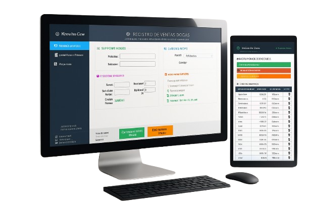
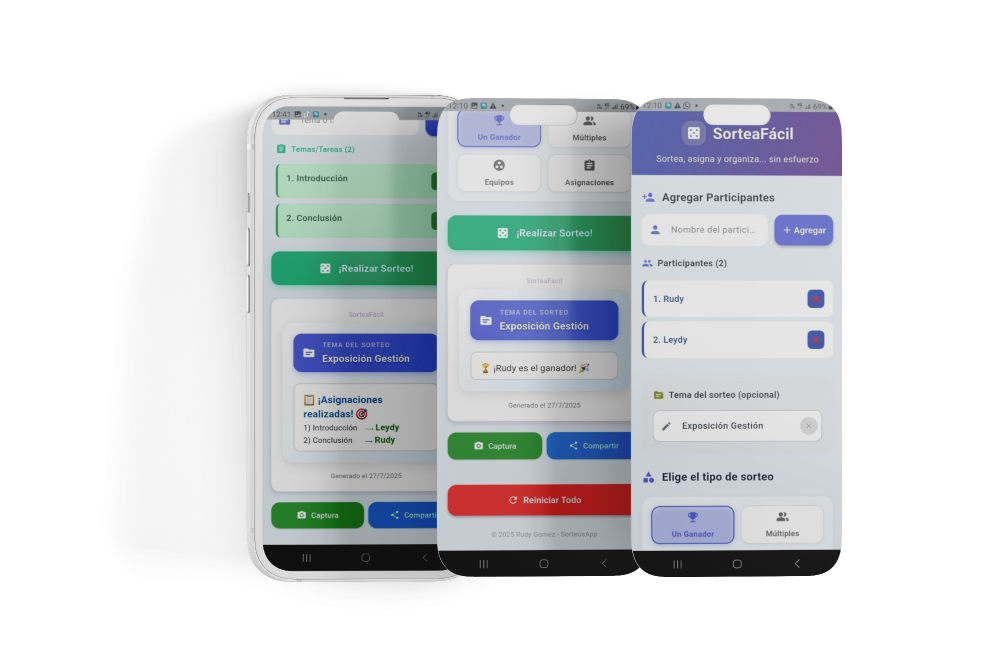
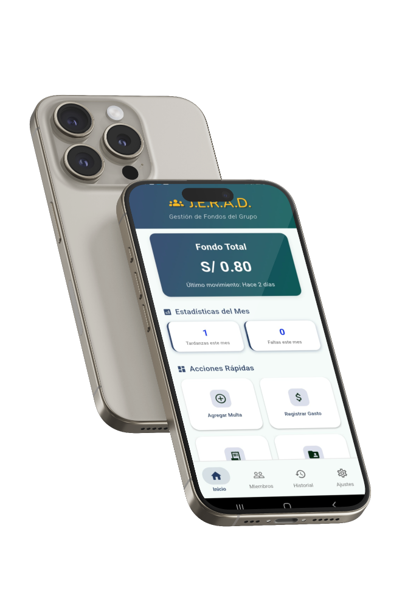

 

 
 

 
<table width="100%">
<tr>
<td width="58%" valign="top">

### ⚡ Quién soy

Estudio **Ingeniería de Sistemas** en la UNSCH y me obsesiona convertir ideas en productos que la gente realmente usa. Construyo apps móviles con **Flutter**, sistemas web con **Node.js**, y ahora mismo profundizo en **backend con Java y arquitectura de software** vía Oracle Next Education.

En 2025 fui **ponente en el congreso COSEIN-2025** (UNSLG) presentando un trabajo sobre detección de epilepsia infantil con Deep Learning aplicado a señales EEG — la investigación también me atrae, no solo el código.

> *"No busco solo que compile — busco que resuelva algo real."*

</td>
<td width="42%" valign="top" align="center">

</td>
</tr>
</table>

 

## 🧩 Tecnologías

  

 

## 🚀 Proyectos Destacados

### 🚌 Sistema de Gestión de Reservas - Qori Wayra

**Plataforma completa de reserva de pasajes en línea**

✨ Sistema de pagos integrado | 📧 Boletas automáticas | 👨‍💼 Panel administrativo

**Tech Stack:** `HTML5` `CSS3` `JavaScript` `Node.js` `Express` `SQL Server`

---

### ⛽ Sistema de Ventas - K@serito Gas

**Sistema completo de gestión de ventas de gas**

📊 Reportes automáticos | 📈 Gráficos visuales | 🖥️ Interfaz intuitiva

**Tech Stack:** `C#` `Windows Forms` `SQLite`

---

### 🎲 SorteaFácil

**App Flutter para sorteos dinámicos y aleatorios**

🎨 Temas personalizables | ⚡ Rendimiento optimizado | 📱 Diseño nativo

**Tech Stack:** `Flutter` `Dart`

---

### 💰 Group Fund Tracker

**Gestión inteligente de gastos grupales**

💸 Control de gastos | 📄 Reportes PDF | 📊 Análisis financiero

**Tech Stack:** `Flutter` `Dart` `Hive`

 

## 🎓 Educación & Charlas

<table width="100%">
<tr><td width="33%" align="center">🏛️ <b>UNSCH</b> Ing. de Sistemas · 2022–2027</td>
<td width="33%" align="center">🎤 <b>COSEIN-2025</b> Ponente · Deep Learning + EEG</td>
<td width="33%" align="center">☕ <b>Oracle Next Education</b> Backend Java · Alura Latam</td></tr>
</table>

 

**⭐ Si algo de esto te sirvió, un fork o una estrella se agradece.**

